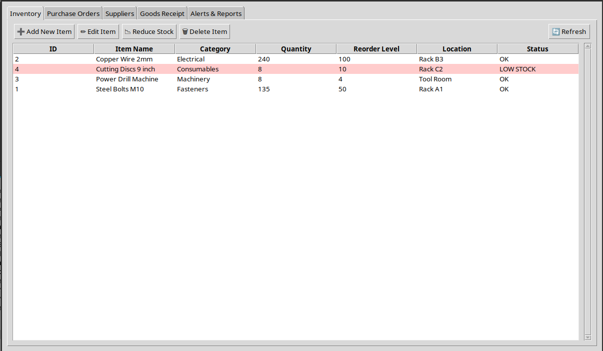
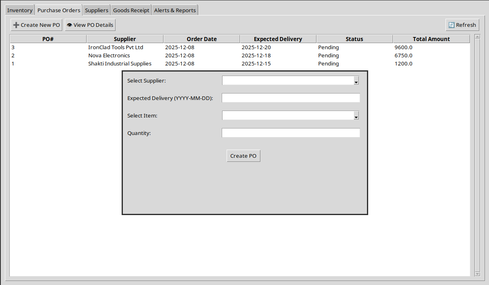
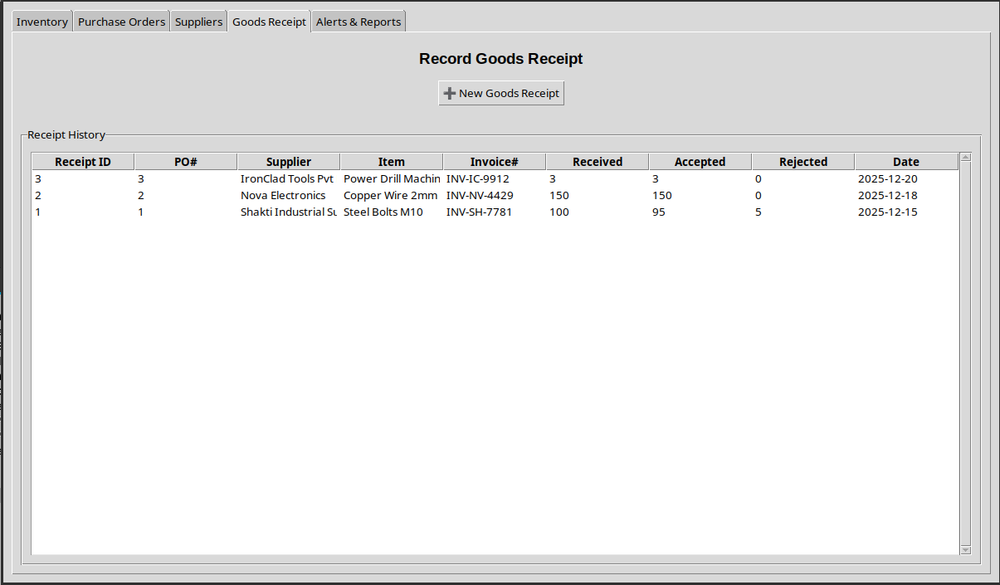

# Purchase Inventory Management System

A desktop application for managing purchase department operations including inventory tracking, supplier management, purchase orders, and goods receipt.

## Features
- Inventory management with low stock alerts
- Supplier database
- Purchase order creation and tracking
- Goods receipt with quality control (accepted/rejected items)
- Automated PO status updates

## Technologies Used
- Python 3
- Tkinter (GUI)
- SQLite (Database)

## How to Run
```bash
python purchase_system.py
```

## Requirements
- Python 3.x
- tkinter (usually comes with Python)
- sqlite3 (built-in)

## Screenshots



